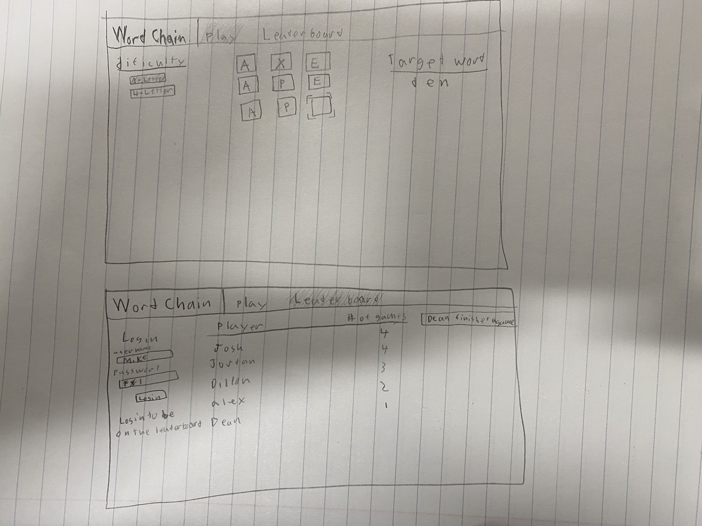

# Word Chain

[My Notes](notes.md)

This will be a small word game that you are able to play in your browser. You will be given a starting word and an ending word. Your goal is to reach the ending word by only making single letter changes to your word with each intermediate word having to be a real word.

## 🚀 Specification Deliverable

For this deliverable I did the following. I checked the box `[x]` and added a description for things I completed.

- [x] Proper use of Markdown
- [x] A concise and compelling elevator pitch
- [x] Description of key features
- [x] Description of how you will use each technology
- [x] One or more rough sketches of your application. Images must be embedded in this file using Markdown image references.

### Elevator pitch

Word Chain is a fun little word game that will be easy to pickup that will be able to test your knowledge of word. Your goal in the game is go from one word to another by only making single letter changes to the the word until you reach the final word. This short game will be a good way of spending some spare time as there is not a huge time investment because each round of the game is quick.

### Design

Will have a minimalistic style with a tab for playing the game and a tab to look at the leaderboard.

### Key features

- input words and check to make sure they follow the rules of the game.
- checks if you made it to the final word and updates the leaderboard appropriatly.
- Live updates of other completing games.
- login screen that allows users to show up on the leaderboard.
- A difficulty selctor to choose the difficulty of the game

### Technologies

I am going to use the required technologies in the following ways.

- **HTML** - Adds the framework for all of the content that needs to be displayed.
- **CSS** - Formats the HTML so that the site will look good.
- **React** - Used to add the game logic to the site.
- **Service** - get words to use from a dictionary
- **DB/Login** - store log in information
- **WebSocket** - have a live updated leaderboard that notifies other users when it is updated

## 🚀 AWS deliverable

For this deliverable I did the following. I checked the box `[x]` and added a description for things I completed.

- [x] **Server deployed and accessible with custom domain name** - [My server link](https://wordchain.click).

## 🚀 HTML deliverable

For this deliverable I did the following. I checked the box `[x]` and added a description for things I completed.

- [x] **HTML pages** - I added 3 pages for each section of the website
- [x] **Proper HTML element usage** - I used multiple different types of html elements throughout the project
- [x] **Links** - There are links to get to every page of the project
- [x] **Text** - I added a guide section to the project to explain the game for users.
- [x] **3rd party API placeholder** - I put a place to display a random word
- [x] **Images** - I put a picture in the guide section so its not a wall of text.
- [x] **Login placeholder** - added a login screen with input tags for users to enter there information
- [x] **DB data placeholder** - added a table that shows users completions of games and fastest time
- [x] **WebSocket placeholder** - added a notification bar that will display when a user finishes a game in real time

## 🚀 CSS deliverable

For this deliverable I did the following. I checked the box `[x]` and added a description for things I completed.

- [x] **Visually appealing colors and layout. No overflowing elements.** - I added styling to all the elements.
- [x] **Use of a CSS framework** - I used bootstrap mainly for the buttons and the navbar
- [x] **All visual elements styled using CSS** - I used css to make the grid in the play page.
- [x] **Responsive to window resizing using flexbox and/or grid display** - I used flexbox throughout the app for centering and responsive design
- [x] **Use of a imported font** - imported the lexend font from google
- [x] **Use of different types of selectors including element, class, ID, and pseudo selectors** - i used all forms of selectors to be able to change the style of the program

## 🚀 React part 1: Routing deliverable

For this deliverable I did the following. I checked the box `[x]` and added a description for things I completed.

- [x] **Bundled using Vite** - I am using vite to be able to run the application.
- [x] **Components** - I have changed all of my html into jsx components.
- [x] **Router** - I am using a router in app.jsx to change between pages.

## 🚀 React part 2: Reactivity deliverable

For this deliverable I did the following. I checked the box `[x]` and added a description for things I completed.

- [x] **All functionality implemented or mocked out** - All game logic is complete and backend functionality mocked out.
- [x] **Hooks** - Used multiple useEffect and useState hooks throughout the program.

## 🚀 Service deliverable

For this deliverable I did the following. I checked the box `[x]` and added a description for things I completed.

- [ ] **Node.js/Express HTTP service** - I did not complete this part of the deliverable.
- [ ] **Static middleware for frontend** - I did not complete this part of the deliverable.
- [ ] **Calls to third party endpoints** - I did not complete this part of the deliverable.
- [ ] **Backend service endpoints** - I did not complete this part of the deliverable.
- [ ] **Frontend calls service endpoints** - I did not complete this part of the deliverable.
- [ ] **Supports registration, login, logout, and restricted endpoint** - I did not complete this part of the deliverable.

## 🚀 DB deliverable

For this deliverable I did the following. I checked the box `[x]` and added a description for things I completed.

- [ ] **Stores data in MongoDB** - I did not complete this part of the deliverable.
- [ ] **Stores credentials in MongoDB** - I did not complete this part of the deliverable.

## 🚀 WebSocket deliverable

For this deliverable I did the following. I checked the box `[x]` and added a description for things I completed.

- [ ] **Backend listens for WebSocket connection** - I did not complete this part of the deliverable.
- [ ] **Frontend makes WebSocket connection** - I did not complete this part of the deliverable.
- [ ] **Data sent over WebSocket connection** - I did not complete this part of the deliverable.
- [ ] **WebSocket data displayed** - I did not complete this part of the deliverable.
- [ ] **Application is fully functional** - I did not complete this part of the deliverable.
